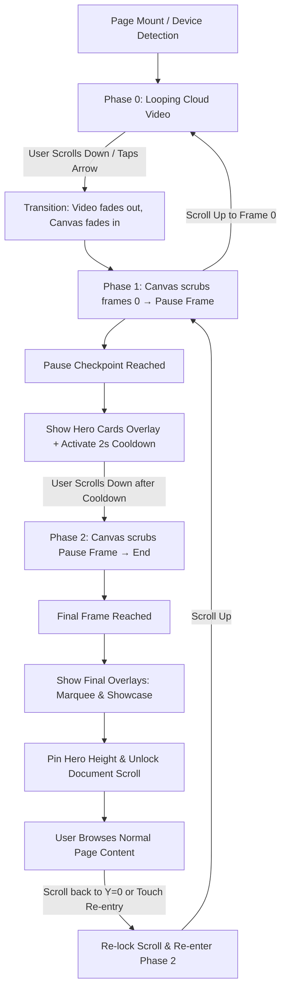

# Master Guide: Canvas Frame Sequence & Virtual Scroll Animation Architecture

> A complete, production-grade architectural guide and implementation blueprint for building Apple/Tesla-style frame-by-frame interactive scroll animations with pause checkpoints, video crossfades, and touch re-entry.

---

## Table of Contents

1. [Executive Summary & Core Concept](#1-executive-summary--core-concept)
2. [Why This Architecture? (Canvas vs. Video Scrubbing)](#2-why-this-architecture-canvas-vs-video-scrubbing)
3. [System Architecture & State Flow](#3-system-architecture--state-flow)
4. [The 3-Phase State Machine Deep Dive](#4-the-3-phase-state-machine-deep-dive)
5. [The Hybrid Rendering Engine (Video Loop + Canvas)](#5-the-hybrid-rendering-engine-video-loop--canvas)
6. [Input Virtualization & GSAP Observer](#6-input-virtualization--gsap-observer)
7. [Mobile Engineering & Critical Edge Cases](#7-mobile-engineering--critical-edge-cases)
   - [Preventing 100dvh Layout Shifts (Address Bar Collapse)](#preventing-100dvh-layout-shifts-address-bar-collapse)
   - [Mobile Touch Re-entry Engine](#mobile-touch-re-entry-engine)
   - [Breakpoint Detection & Memory Optimization](#breakpoint-detection--memory-optimization)
8. [Page Lifecycle & Route Re-entry (`checkScrollPosition` & Reset Event)](#8-page-lifecycle--route-re-entry)
9. [UI Overlay Synchronization (Cards, Marquee, Hints)](#9-ui-overlay-synchronization)
10. [Asset Preparation Pipeline (FFmpeg Commands)](#10-asset-preparation-pipeline)
11. [Complete Reusable Boilerplate Template (Copy-Paste Ready)](#11-complete-reusable-boilerplate-template)
12. [Troubleshooting & Performance Checklist](#12-troubleshooting--performance-checklist)

---

## 1. Executive Summary & Core Concept

This hero section is an **interactive frame-scrubbing state machine** that replaces standard web page scrolling with a cinematic, highly controlled storytelling experience:

1. **Initial State (Phase 0)**: The user lands on an ambient looping video (clouds/atmosphere) with standard page scrolling locked (`overflow: hidden`). It uses negligible CPU/GPU because it's just a lightweight looping MP4 video.
2. **First Scroll Action (Phase 1)**: The page seamlessly crossfades from the looping video into an HTML5 `<canvas>`. The canvas renders preloaded WebP frames indexed by a virtual clock (`virtualTime`).
3. **Midway Pause Checkpoint**: The sequence automatically stops at a predetermined keyframe (e.g., Frame 74 on desktop). High-converting UI overlays (e.g. Glassmorphic Feature Cards) animate in. A 2-second cooldown prevents accidental double-scrolling from trackpad inertia.
4. **Second Scroll Action (Phase 2)**: The user scrolls again. The cards fade out, the canvas scrubs the remaining frames to the end of the sequence, and final overlays (Review Marquee & Video Showcase) appear.
5. **Page Scroll Unlock**: Once the final frame is reached, the hero container height is pinned to its exact computed pixels, the native document scroll is unlocked (`overflow: auto`), and the user can browse the rest of the website normally.
6. **Reverse Scrubbing & Re-entry**: If the user scrolls back to the top of the page, the hero seamlessly re-locks the scroll and allows reverse frame playback all the way back to the initial video loop.

---

## 2. Why This Architecture? (Canvas vs. Video Scrubbing)

Many developers try to achieve this effect by modifying `HTMLMediaElement.currentTime` via scroll position (`video.currentTime = scrollPercent * video.duration`). **This approach invariably fails in production**:

| Feature / Issue | Video Scrubbing (`<video>.currentTime`) | Preloaded Canvas WebP Sequence |
| :--- | :--- | :--- |
| **Frame Accuracy** | Inaccurate; snaps to the nearest video keyframe (I-frame / GOP group). | **100% exact frame-by-frame precision.** |
| **Reverse Playback** | Horrible stutter and dropped frames; video decoders are optimized for forward playback. | **Flawless 60fps reverse playback.** |
| **Browser Throttling** | Safari on iOS throttles or refuses rapid seek operations. | **Zero throttling**; images are already in GPU memory. |
| **Latency** | 50ms – 200ms lag between scroll input and frame paint. | **Instantaneous (under 16ms / 1 frame render).** |
| **Idle Resource Usage** | High if running full 4K frame sequence in memory all the time. | **Near zero**; runs a 2MB looping MP4 while idle, only loads canvas on demand. |

---

## 3. System Architecture & State Flow



---

## 4. The 3-Phase State Machine Deep Dive

The animation is managed by two primary state variables and a decoupled time accumulator:

```typescript
let currentPhase = 0; // 0 = Cloud Video Loop, 1 = Frame 0 to Pause, 2 = Pause to End
let playState = 0;    // -1 = Playing Reverse, 0 = Paused/Idle, 1 = Playing Forward
let virtualTime = 0;  // Current playback timestamp in seconds
let scrollLocked = true; // Governs whether native body scroll is disabled
```

### Frame Configuration Parameters

```typescript
const DESKTOP = {
  frameCount: 127,
  fps: 24,
  width: 1920,
  height: 1080,
  pauseTime: 73 / 24, // Frame 74 (0-indexed: 73) -> ~3.042 seconds
  pathTemplate: (i: number) => `/frames/frames_${i.toString().padStart(4, "0")}.webp`,
  videoPath: "/cloudmovingdesk.mp4",
  posterFrame: "/frames/frames_0001.webp",
};

const duration = config.frameCount / config.fps; // 127 / 24 = ~5.29s
```

### The Decoupled GSAP Ticker Engine

Instead of tying frame index directly to `window.scrollY` (which produces jagged movement), playback is driven by `gsap.ticker`. Each frame tick advances `virtualTime` by the true delta time:

```typescript
const tickerFunc = (time: number, deltaTime: number) => {
  if (!vid0 || !canvas) return;
  const deltaSec = deltaTime / 1000; // e.g. ~0.0166s at 60fps

  if (playState === 1) {
    // ── FORWARD PLAYBACK ──
    if (currentPhase === 0) {
      playSafe(vid0);
    } else if (currentPhase === 1) {
      virtualTime += deltaSec;
      if (virtualTime >= pauseTime) {
        virtualTime = pauseTime;
        playState = 0; // Stop and pause
        setShowPauseCards(true);
        setShowNavbar(true);

        // 2-Second Cooldown to absorb high-velocity mouse wheel spins
        pauseCooldownRef.current = true;
        setTimeout(() => { pauseCooldownRef.current = false; }, 2000);
        startPhase1IdleTimer();
      }
      renderFrame();
    } else if (currentPhase === 2) {
      virtualTime += deltaSec;
      if (virtualTime >= duration - 0.1) {
        virtualTime = duration - 0.1;
        playState = 0; // Finished
        setShowNavbar(true);
        setShowFinalOverlay(true);
        if (scrollLocked) {
          setTimeout(() => { unlockScroll(); }, 50);
        }
      }
      renderFrame();
    }
  } else if (playState === -1) {
    // ── REVERSE PLAYBACK ──
    if (currentPhase === 1) {
      virtualTime -= deltaSec;
      if (virtualTime <= 0) {
        virtualTime = 0;
        currentPhase = 0;
        transitionToCloud(); // Crossfade canvas out, video back in
        playState = 1;       // Resume cloud loop
      }
      renderFrame();
    } else if (currentPhase === 2) {
      virtualTime -= deltaSec;
      if (virtualTime <= pauseTime) {
        virtualTime = pauseTime;
        currentPhase = 1;
        playState = 0; // Pause at the cards checkpoint again
        setShowPauseCards(true);
        pauseCooldownRef.current = true;
        setTimeout(() => { pauseCooldownRef.current = false; }, 2000);
      }
      renderFrame();
    }
  }
};
```

### The Canvas Drawing Method (`renderFrame`)

Drawing into the 2D canvas is lightweight and fast:

```typescript
const renderFrame = () => {
  if (!ctx || !canvas || imagesRef.current.length === 0) return;

  // Convert fractional virtual time into an integer frame index
  let frameIndex = Math.floor(virtualTime * config.fps);
  if (frameIndex < 0) frameIndex = 0;
  if (frameIndex >= config.frameCount) frameIndex = config.frameCount - 1;

  const img = imagesRef.current[frameIndex];
  if (img && img.complete && img.naturalWidth !== 0) {
    ctx.clearRect(0, 0, canvas.width, canvas.height);
    ctx.drawImage(img, 0, 0, canvas.width, canvas.height);
  }
};
```

---

## 5. The Hybrid Rendering Engine (Video Loop + Canvas)

A common performance pitfall is rendering the entire experience through canvas frames. If a user leaves the tab open on the hero, rendering hundreds of frames over and over wastes battery and memory.

### The Solution: DOM Layering & GSAP Crossfade

```
Layer 1 (z-index: 1):    (Instant fallback)
Layer 2 (z-index: 2):  <video src="loop.mp4" />   (Ambient cloud loop)
Layer 3 (z-index: 10): <canvas />                 (Scrubbed frame sequence)
Layer 4 (z-index: 40): Overlays (Cards / Videos)  (UI elements)
Layer 5 (z-index: 50): Hints & Chevron Buttons    (Interaction prompts)
```

#### Transition: Video to Canvas (`transitionToMain`)
```typescript
const transitionToMain = () => {
  if (!vid0 || !canvas) return;
  gsap.killTweensOf([vid0, canvas]);
  gsap.set(canvas, { zIndex: 10, opacity: 1 });
  gsap.set(vid0, { zIndex: 20 });
  gsap.to(vid0, { opacity: 0, duration: 0.5 });
};
```

#### Transition: Canvas to Video (`transitionToCloud`)
```typescript
const transitionToCloud = () => {
  if (!vid0 || !canvas) return;
  gsap.killTweensOf([vid0, canvas]);
  gsap.set(vid0, { zIndex: 10, opacity: 1 });
  gsap.set(canvas, { zIndex: 20 });
  gsap.to(canvas, { opacity: 0, duration: 0.5 });
};
```

---

## 6. Input Virtualization & GSAP Observer

To intercept scroll events before the browser natively scrolls the document, the system uses **GSAP Observer**:

```typescript
import { Observer } from "gsap/Observer";
gsap.registerPlugin(Observer);
```

### Observer Configuration

```typescript
const observer = Observer.create({
  target: window,
  type: "wheel,touch,pointer",
  preventDefault: !isMobileDevice, // True on desktop, false on mobile
  onDown: (self) => {
    // Touch: swipe down = scroll up = reverse
    // Wheel: wheel down = scroll down = forward
    const isTouch = Boolean(
      self?.isTouch || self?.event?.type?.startsWith("touch") || self.event?.pointerType === "touch"
    );
    if (isTouch) {
      handleMobileScrollReverse();
    } else {
      handleScrollForward();
    }
  },
  onUp: (self) => {
    // Touch: swipe up = scroll down = forward
    // Wheel: wheel up = scroll up = reverse
    const isTouch = Boolean(
      self?.isTouch || self?.event?.type?.startsWith("touch") || self.event?.pointerType === "touch"
    );
    if (isTouch) {
      handleMobileScrollForward();
    } else {
      handleScrollReverse();
    }
  },
});
```

### Phase Transition Trigger Logic

```typescript
const handleScrollForward = () => {
  if (!scrollLocked) return;

  if (currentPhase === 0) {
    currentPhase = 1;
    transitionToMain();
    playState = 1;
    setShowNavbar(false);
    clearAllHints();
    setShowProgress(true);
  } else if (currentPhase === 1) {
    if (pauseCooldownRef.current) return; // Ignore input during 2s pause cooldown
    if (playState === 0 && virtualTime >= pauseTime - 0.1) {
      currentPhase = 2;
      playState = 1;
      setShowPauseCards(false);
      setShowNavbar(false);
      clearAllHints();
    }
  } else if (currentPhase === 2) {
    playState = 1;
  }
};
```

---

## 7. Mobile Engineering & Critical Edge Cases

Building frame sequences on mobile involves three major challenges that break standard implementations. Here is how this codebase solves them:

### Preventing 100dvh Layout Shifts (Address Bar Collapse)

When a mobile browser switches `document.body.style.overflow` from `"hidden"` to `"auto"`, the URL address bar responds to subsequent scrolling by collapsing or expanding. This causes `100dvh` (or `100vh`) to abruptly recalculate by 60–100px, causing the section immediately below the hero (e.g. `<TrustedBy>`) to violently jump.

#### The Solution: Pixel Pinning
Before unlocking native scroll, calculate the container's rendered pixel height and freeze it with inline styles:

```typescript
const unlockScroll = () => {
  scrollLocked = false;
  observer.disable();

  // Pin hero container to exact rendered pixels BEFORE unlocking overflow
  const container = containerRef.current;
  if (container) {
    const currentHeight = container.getBoundingClientRect().height;
    container.style.height = `${currentHeight}px`; // e.g. "812px"
  }

  // Defer overflow change by one animation frame
  requestAnimationFrame(() => {
    document.body.style.overflow = "auto";
    if (isMobileDevice) addReentryListeners();
  });
};
```

When re-entering the hero from below, unpin the height:

```typescript
const lockScroll = () => {
  scrollLocked = true;
  document.body.style.overflow = "hidden";

  // Restore dynamic dvh sizing
  const container = containerRef.current;
  if (container) {
    container.style.height = "";
  }
  
  if (window.scrollY > 0) {
    window.scrollTo({ top: 0, behavior: "smooth" });
  }
  observer.enable();
};
```

---

### Mobile Touch Re-entry Engine

When native scroll is unlocked and the user scrolls down the page, desktop users trigger `onNativeScroll` when `window.scrollY <= 0`. On mobile devices, however, iOS Safari rubber-bands (bounces) at `scrollY = 0`, causing native scroll events to misreport or miss the boundary completely.

#### The Solution: Touch-Drag Delta Listener
Listen specifically for a finger drag-down motion when `window.scrollY <= 0`:

```typescript
let reentryTouchStartY = 0;

const onReentryTouchStart = (e: TouchEvent) => {
  reentryTouchStartY = e.touches[0].clientY;
};

const onReentryTouchMove = (e: TouchEvent) => {
  if (window.scrollY <= 0) {
    const deltaY = e.touches[0].clientY - reentryTouchStartY;
    if (deltaY > 20) { // Finger dragged down by >20px at the top
      e.preventDefault();
      removeReentryListeners();
      lockScroll();
      currentPhase = 2; // Re-enter at the end of the sequence
      playState = 0;
      setActiveArrows("none");
      startPhase1IdleTimer();
    }
  }
};
```

---

### Breakpoint Detection & Memory Optimization

Loading 127 desktop frames (1920×1080) on a mobile device consumes excessive RAM and will cause Safari on iOS to crash due to memory pressure.

#### The Solution: Conditional Preloading
Detect screen width on initial mount before initiating any image downloads:

```typescript
useEffect(() => {
  const isMobile = window.innerWidth < MOBILE_BREAKPOINT;
  setConfig(isMobile ? MOBILE : DESKTOP);
}, []);

useEffect(() => {
  if (!config) return; // Do not fetch until target device is resolved
  const images: HTMLImageElement[] = [];
  for (let i = 1; i <= config.frameCount; i++) {
    const img = new Image();
    img.src = config.pathTemplate(i);
    images.push(img);
  }
  imagesRef.current = images;
}, [config]);
```

---

## 8. Page Lifecycle & Route Re-entry

### Handling Browser "Back" Navigation (`checkScrollPosition`)

If a user navigates to an internal page (e.g. `/portfolio`) and hits the browser's Back button, the browser may restore scroll position to e.g. `scrollY = 1200`. If the hero blindly locked body scroll on mount, the user would be trapped down the page with scrolling disabled.

```typescript
const checkScrollPosition = () => {
  if (window.scrollY > 50) {
    scrollLocked = false;
    document.body.style.overflow = "auto";
    observer.disable();

    // Fast-forward animation to the end state
    currentPhase = 2;
    virtualTime = duration - 0.1;
    playState = 0;

    setShowPauseCards(false);
    setShowFinalOverlay(true);
    setShowNavbar(true);
    setShowProgress(false);

    if (vid0 && canvas) {
      canvas.style.opacity = "1";
      vid0.style.opacity = "0";
    }
    renderFrame();
  }
};

checkScrollPosition();
setTimeout(checkScrollPosition, 50);
setTimeout(checkScrollPosition, 150);
```

### Global Decoupled Reset Event (`reset-hero-start`)

Any component on the site (Navbar logo, Footer "Back to Top" button) can reset the hero to its pristine starting condition using standard window custom events:

```typescript
// Dispatched from Navbar.tsx or Footer.tsx:
window.dispatchEvent(new CustomEvent("reset-hero-start"));

// Captured inside Hero.tsx:
const onResetHeroStart = () => {
  window.scrollTo({ top: 0, behavior: "smooth" });
  lockScroll();
  currentPhase = 0;
  virtualTime = 0;
  playState = 1;
  setShowPauseCards(false);
  setShowFinalOverlay(false);
  setShowNavbar(true);

  if (vid0 && canvas) {
    gsap.killTweensOf([vid0, canvas]);
    vid0.style.opacity = "1";
    vid0.style.zIndex = "20";
    vid0.currentTime = 0;
    vid0.play().catch(() => {});
    canvas.style.opacity = "0";
    canvas.style.zIndex = "10";
  }
  renderFrame();
  startPhase0IdleTimer();
};
window.addEventListener("reset-hero-start", onResetHeroStart);
```

---

## 9. UI Overlay Synchronization

### 1. The Vertical Progress Bar
A minimal vertical progress bar indicating progress through the sequence:

```typescript
const updateProgress = () => {
  progressTickRef.current++;
  // Throttle React state updates to every 3rd animation tick (20fps updates)
  if (progressTickRef.current % 3 === 0 && currentPhase > 0) {
    setScrollProgress(virtualTime / duration);
  }
};
```

### 2. Glassmorphic Cards Overlay (`<HeroCards />`)
Triggered during Phase 1 pause (`visible={showPauseCards}`). Uses Framer Motion's `AnimatePresence` with staggered card entrance and subtle backdrop blur:

```tsx
<motion.div
  initial={{ y: 40, scale: 0.95 }}
  animate={{ y: 0, scale: 1 }}
  exit={{ y: 20, scale: 0.97 }}
  transition={{ delay: 0.2 + i * 0.15, duration: 0.6, ease: [0.22, 1, 0.36, 1] }}
>
  ...
</motion.div>
```

### 3. Review Marquee & Video Showcase
Fades into view when Phase 2 concludes (`visible={showFinalOverlay}`). Pauses on hover via CSS:

```css
@keyframes marquee-scroll {
  0% { transform: translateX(0); }
  100% { transform: translateX(-50%); }
}

.animate-marquee {
  animation: marquee-scroll 55s linear infinite;
}

.animate-marquee:hover {
  animation-play-state: paused;
}
```

---

## 10. Asset Preparation Pipeline

To build this in your own project, you need two items:
1. An ambient looping video (e.g. 3–5 seconds) for the idle background.
2. A rendered 3D camera move or drone video for the frame sequence.

### Step 1: Extract WebP Frames Using FFmpeg

Execute this in your terminal to generate high-efficiency, compressed WebP frames:

```bash
# Desktop sequence (1920x1080 @ 24fps)
ffmpeg -i render_desktop.mp4 \
  -vf "fps=24,scale=1920:1080:flags=lanczos" \
  -vcodec libwebp \
  -quality 82 \
  -lossless 0 \
  -compression_level 6 \
  public/frames/frames_%04d.webp

# Mobile sequence (900x1600 portrait @ 24fps)
ffmpeg -i render_mobile.mp4 \
  -vf "fps=24,scale=900:1600:flags=lanczos" \
  -vcodec libwebp \
  -quality 80 \
  -lossless 0 \
  -compression_level 6 \
  public/frames_mob/frame_%04d.webp
```

*Note: Use `-lossless 0` with quality between 80–85. WebP files will average 25KB–45KB each, keeping 120 frames under ~4MB total.*

### Step 2: Extract the First Frame Poster
```bash
cp public/frames/frames_0001.webp public/frames/poster.webp
```

---

## 11. Complete Reusable Boilerplate Template

Here is a streamlined, standalone template you can copy directly into any Next.js / React project:

```tsx
"use client";

import React, { useRef, useEffect, useState } from "react";
import gsap from "gsap";
import { Observer } from "gsap/Observer";
import { useGSAP } from "@gsap/react";

gsap.registerPlugin(Observer);

interface SequenceConfig {
  frameCount: number;
  fps: number;
  width: number;
  height: number;
  pauseTime: number;
  pathTemplate: (index: number) => string;
  videoPath: string;
  posterFrame: string;
}

const CONFIG: SequenceConfig = {
  frameCount: 120,
  fps: 24,
  width: 1920,
  height: 1080,
  pauseTime: 60 / 24, // Pause at frame 60
  pathTemplate: (i) => `/frames/frames_${i.toString().padStart(4, "0")}.webp`,
  videoPath: "/ambient_loop.mp4",
  posterFrame: "/frames/frames_0001.webp",
};

export function ReusableHeroSequence() {
  const containerRef = useRef<HTMLDivElement>(null);
  const videoRef = useRef<HTMLVideoElement>(null);
  const canvasRef = useRef<HTMLCanvasElement>(null);
  const imagesRef = useRef<HTMLImageElement[]>([]);

  const [phase, setPhase] = useState<number>(0);
  const [showOverlay, setShowOverlay] = useState<boolean>(false);
  const cooldownRef = useRef<boolean>(false);

  const duration = CONFIG.frameCount / CONFIG.fps;

  // 1. Preload sequence into memory
  useEffect(() => {
    const images: HTMLImageElement[] = [];
    for (let i = 1; i <= CONFIG.frameCount; i++) {
      const img = new Image();
      img.src = CONFIG.pathTemplate(i);
      images.push(img);
    }
    imagesRef.current = images;
  }, []);

  useGSAP(() => {
    let currentPhase = 0; // 0 = Loop, 1 = Part 1, 2 = Part 2
    let playState = 0;    // -1 = reverse, 0 = idle, 1 = forward
    let virtualTime = 0;
    let scrollLocked = true;

    document.body.style.overflow = "hidden";

    const vid = videoRef.current;
    const canvas = canvasRef.current;
    const ctx = canvas?.getContext("2d");

    if (canvas) {
      canvas.width = CONFIG.width;
      canvas.height = CONFIG.height;
    }

    const render = () => {
      if (!ctx || !canvas || imagesRef.current.length === 0) return;
      let frameIndex = Math.floor(virtualTime * CONFIG.fps);
      frameIndex = Math.max(0, Math.min(CONFIG.frameCount - 1, frameIndex));
      const img = imagesRef.current[frameIndex];
      if (img && img.complete) {
        ctx.clearRect(0, 0, canvas.width, canvas.height);
        ctx.drawImage(img, 0, 0, canvas.width, canvas.height);
      }
    };

    const unlockScroll = () => {
      scrollLocked = false;
      observer.disable();
      if (containerRef.current) {
        containerRef.current.style.height = `${containerRef.current.getBoundingClientRect().height}px`;
      }
      requestAnimationFrame(() => {
        document.body.style.overflow = "auto";
      });
    };

    const lockScroll = () => {
      scrollLocked = true;
      document.body.style.overflow = "hidden";
      if (containerRef.current) containerRef.current.style.height = "";
      if (window.scrollY > 0) window.scrollTo({ top: 0, behavior: "smooth" });
      observer.enable();
    };

    const ticker = (_: number, deltaTime: number) => {
      const deltaSec = deltaTime / 1000;

      if (playState === 1) {
        if (currentPhase === 0) {
          if (vid?.paused) vid.play().catch(() => {});
        } else if (currentPhase === 1) {
          virtualTime += deltaSec;
          if (virtualTime >= CONFIG.pauseTime) {
            virtualTime = CONFIG.pauseTime;
            playState = 0;
            setShowOverlay(true);
            cooldownRef.current = true;
            setTimeout(() => { cooldownRef.current = false; }, 2000);
          }
          render();
        } else if (currentPhase === 2) {
          virtualTime += deltaSec;
          if (virtualTime >= duration - 0.1) {
            virtualTime = duration - 0.1;
            playState = 0;
            if (scrollLocked) setTimeout(unlockScroll, 50);
          }
          render();
        }
      } else if (playState === -1) {
        if (currentPhase === 1) {
          virtualTime -= deltaSec;
          if (virtualTime <= 0) {
            virtualTime = 0;
            currentPhase = 0;
            playState = 1;
            gsap.to(vid, { opacity: 1, duration: 0.4 });
            gsap.to(canvas, { opacity: 0, duration: 0.4 });
          }
          render();
        } else if (currentPhase === 2) {
          virtualTime -= deltaSec;
          if (virtualTime <= CONFIG.pauseTime) {
            virtualTime = CONFIG.pauseTime;
            currentPhase = 1;
            playState = 0;
            setShowOverlay(true);
            cooldownRef.current = true;
            setTimeout(() => { cooldownRef.current = false; }, 2000);
          }
          render();
        }
      }
    };

    gsap.ticker.add(ticker);

    const onScrollDown = () => {
      if (!scrollLocked) return;
      if (currentPhase === 0) {
        currentPhase = 1;
        playState = 1;
        gsap.to(vid, { opacity: 0, duration: 0.5 });
        gsap.to(canvas, { opacity: 1, duration: 0.5 });
      } else if (currentPhase === 1) {
        if (cooldownRef.current) return;
        if (playState === 0 && virtualTime >= CONFIG.pauseTime - 0.1) {
          currentPhase = 2;
          playState = 1;
          setShowOverlay(false);
        }
      }
    };

    const onScrollUp = () => {
      if (!scrollLocked || (currentPhase === 1 && cooldownRef.current)) return;
      if (currentPhase > 0) {
        playState = -1;
        setShowOverlay(false);
      }
    };

    const observer = Observer.create({
      target: window,
      type: "wheel,touch",
      preventDefault: true,
      onDown: () => onScrollDown(),
      onUp: () => onScrollUp(),
    });

    const onNativeScroll = () => {
      if (!scrollLocked && window.scrollY <= 0) {
        lockScroll();
        currentPhase = 2;
        playState = 0;
      }
    };

    window.addEventListener("scroll", onNativeScroll);

    return () => {
      gsap.ticker.remove(ticker);
      observer.kill();
      window.removeEventListener("scroll", onNativeScroll);
      document.body.style.overflow = "auto";
    };
  }, []);

  return (
    <section ref={containerRef} className="relative w-full h-[100dvh] bg-black overflow-hidden">
      {/* Fallback Poster */}
      

      {/* Ambient Looping Video */}
      <video
        ref={videoRef}
        src={CONFIG.videoPath}
        autoPlay
        loop
        muted
        playsInline
        className="absolute inset-0 w-full h-full object-cover z-[2]"
      />

      {/* Canvas Frame Renderer */}
      <canvas
        ref={canvasRef}
        className="absolute inset-0 w-full h-full object-cover z-[10] opacity-0"
      />

      {/* Overlay UI */}
      {showOverlay && (
        <div className="absolute inset-0 z-40 flex items-center justify-center pointer-events-none">
          <div className="p-8 rounded-3xl bg-white/10 backdrop-blur-md border border-white/20 text-white pointer-events-auto">
            <h2 className="text-2xl font-bold">Checkpoint Content</h2>
            <p className="text-sm opacity-80 mt-2">Scroll again to continue the journey.</p>
          </div>
        </div>
      )}
    </section>
  );
}
```

---

## 12. Troubleshooting & Performance Checklist

### 1. Blurry Canvas on Retina / High-DPI Displays
If the canvas appears soft on MacBook or iPhone screens, match the internal canvas buffer to device pixel ratio:
```typescript
const dpr = Math.min(window.devicePixelRatio || 1, 2);
canvas.width = config.width * dpr;
canvas.height = config.height * dpr;
ctx.scale(dpr, dpr);
```

### 2. High-Velocity Trackpad "Double Skip"
On MacBook trackpads or Logitech free-spin wheels, a single flick sends dozens of wheel events over 1.5 seconds. Always implement the `pauseCooldownRef` (1500ms – 2000ms timeout) at checkpoints to absorb the residual inertia.

### 3. Flashing or Black Frames During Rapid Scrubbing
Never clear the canvas (`ctx.clearRect`) unless you have confirmed that `img.complete && img.naturalWidth !== 0`. If an image hasn't finished loading into cache, clearing the canvas will result in a black flicker.

### 4. Memory Leaks & Stuck Scroll Locks
Always clean up in the React unmount callback:
1. `gsap.ticker.remove(tickerWithProgress)`
2. `observer.kill()`
3. `document.body.style.overflow = "auto"`
4. `window.removeEventListener("scroll", ...)`
5. `window.removeEventListener("touchstart", ...)`
